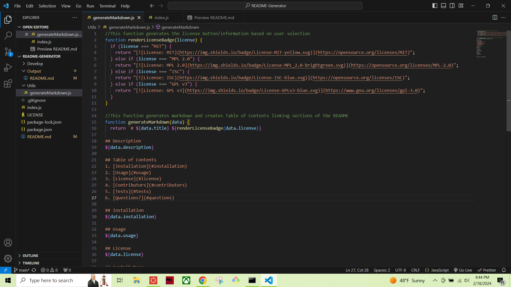
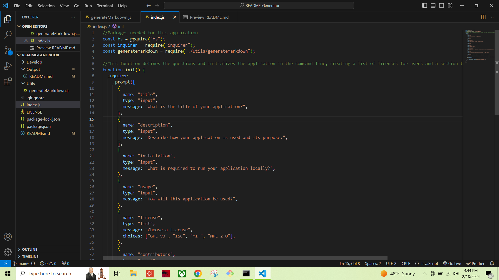
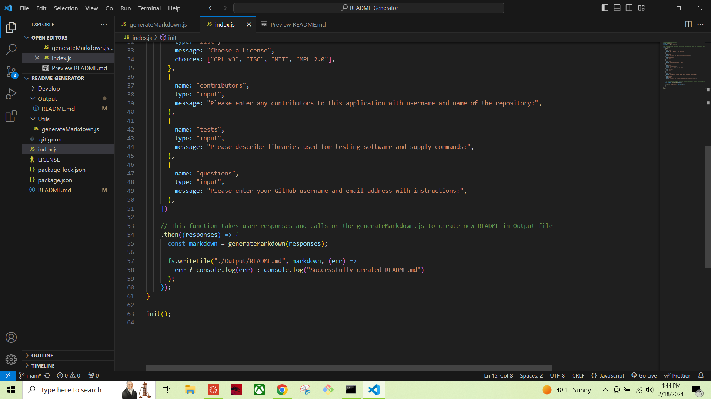
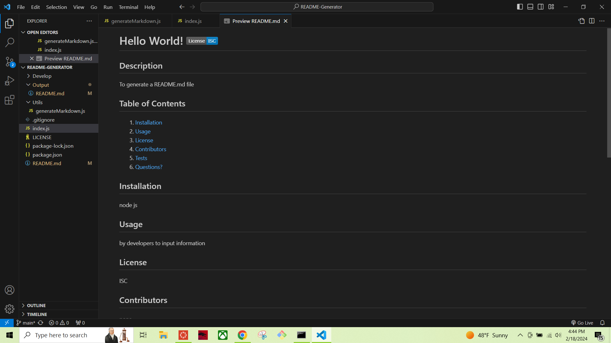
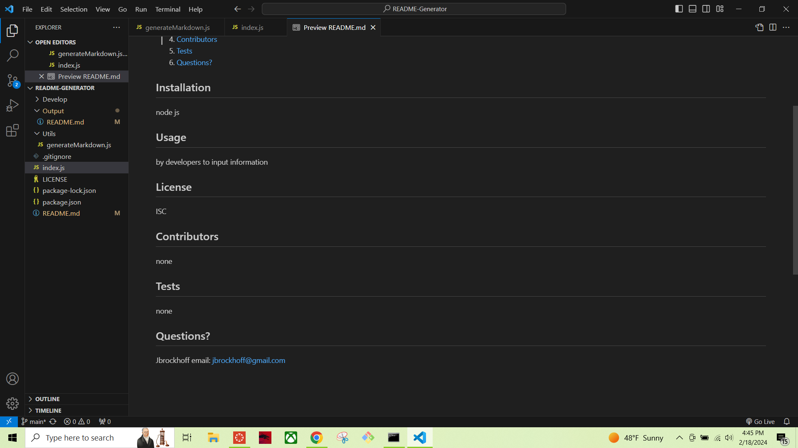

# Professional README Generator 
  
## Description
This application takes user input to relevant, typical README.md criteria and uses the information to automatically generate a personalized, professionl README.md file for use in application development. It will have both input and list selections and will display the license badge at the top of the README. It will also provide a functional Table of Contents within the document.

## Table of Contents
1. [Installation](#installation)
2. [Usage](#usage)
3. [License](#license)
4. [Contributors](#contributors)
5. [Tests](#tests)
6. [Questions?](#questions)

## Installation
User will need to install Node.js using the following website: https://nodejs.org/en/download. The LTS version is recommmeded.
User will also have to initiate the inquirer package by running 'npm install inquirer' in the command line.

## Usage
Software developers will be able to use this application for use when developing a README file by responding to generated prompts.

Here is a link to video of the application functioning:
https://drive.google.com/file/d/1mL6oPa6-QGGAL1SaRrXaQPb41pgsZj9C/view

Here are screenshots of the application:

Here is a link to my GitHub profile:
https://github.com/Jbrockhoff

Here is a link to the GitHub Repositroy for this application:
https://github.com/Jbrockhoff/README-Generator

## License
MIT
Copyright <2024> <Jennie Brockhoff>

Permission is hereby granted, free of charge, to any person obtaining a copy of this software and associated documentation files (the “Software”), to deal in the Software without restriction, including without limitation the rights to use, copy, modify, merge, publish, distribute, sublicense, and/or sell copies of the Software, and to permit persons to whom the Software is furnished to do so, subject to the following conditions:

The above copyright notice and this permission notice shall be included in all copies or substantial portions of the Software.

THE SOFTWARE IS PROVIDED “AS IS”, WITHOUT WARRANTY OF ANY KIND, EXPRESS OR IMPLIED, INCLUDING BUT NOT LIMITED TO THE WARRANTIES OF MERCHANTABILITY, FITNESS FOR A PARTICULAR PURPOSE AND NONINFRINGEMENT. IN NO EVENT SHALL THE AUTHORS OR COPYRIGHT HOLDERS BE LIABLE FOR ANY CLAIM, DAMAGES OR OTHER LIABILITY, WHETHER IN AN ACTION OF CONTRACT, TORT OR OTHERWISE, ARISING FROM, OUT OF OR IN CONNECTION WITH THE SOFTWARE OR THE USE OR OTHER DEALINGS IN THE SOFTWARE.

## Contributors
Tutoring assistance from Chris Baird. 

Tutorials on node.js from NetNinja using this YouTube playlist: https://www.youtube.com/playlist?list=PL4cUxeGkcC9jsz4LDYc6kv3ymONOKxwBU

## Tests
N/A

## Questions?
  GitHub Username: Jbrockhoff

  Email Address: jbrockh1@gmail.com